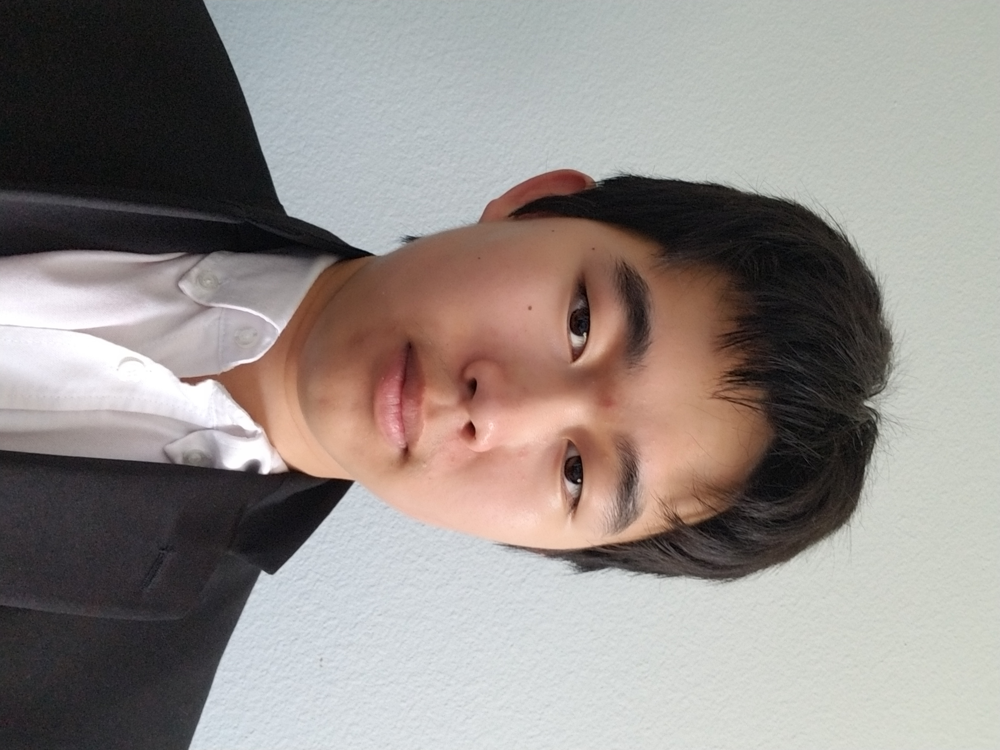

## About Me

I am a graduate student at Purdue University, studying Computer Science. I am especially interested in machine learning and artificial intelligence. I plan to graduate in December 2025.

I got my Bachelor's degree from the University of California Berkeley, which I graduated from in 2024.

I am also on <a href="https://www.linkedin.com/in/derrick-sun-052130228/">LinkedIn</a>, and much of my work can be found on <a href="https://github.com/DerrickhSun">GitHub</a>.

## My Education

#### Purdue University (2024-2025)

I am a Master's student at Purdue University studying Computer Science. I plan to graduate in December 2025. At Purdue, I have focused mainly on studying AI and machine learning, with a lesser emphasis on computer security, distributed systems, and compilers.

#### University of California, Berkeley (2020-2024)

I earned my Bachelor's degree from the University of California, Berkeley, where I did a double major in Computer Science and Applied Math. As a Computer Science major, I focused on machine learning, AI, and algorithms. I also participated in in-context model research.  As a Applied Math major, I also studied statistics and data science.

#### Westview High School

I attended Westview High School.

## Skills

<ul class=skilllist>
      <li>Programming Languages: Python, Java, SQL, C/C++, R, MATLAB, Swift, JavaScript, HTML/CSS</li>
      <li>ML/AI Frameworks: PyTorch, TensorFlow, DSPy, Scikit-learn</li>
      <li>Data Tools: Pandas, NumPy, Matplotlib, Seaborn, RStudio, Jupyter</li>
      <li>Cloud & Databases: AWS S3, Redshift, PostgreSQL, MongoDB</li>
      <li>Development Tools: Git, Docker, Prefect, XCode, LaTeX, RISC-V</li>
    </ul>
  
<section class="experience">
<h2> My Experience </h2>
</section>

#### Bridger Investment Partners (Summer 2024)

I interned with Bridger Investment Partners, an investment firm that focuses on mortgages. I worked as a data scientist, using Prefect to automate their data processing. I also analyzed mortgage data from AWS S3 and Redshift using Python, SQL, and statistics.

#### NewsBreak (Summer 2022)

I interned at NewsBreak, a company that focuses on providing news tailored to a user’s 
location and interests through their mobile app, NewsBreak, under my mentor, Zhengwen Wang. I worked as a front-end programmer for the NewsBreak iOS app, where I used XCode to design a part of the app and became proficient in Swift, data fetching, and programmatic coding in UIKit. The part I designed will be released as the discover-search page of the app.

#### UCSD Nanomaterials and Nanomedicine Laboratory (Summer and Winter 2019)

I interned at UCSD as a Research Analyst Intern. I implemented modern cell membrane coating technology, including cell counting, pating, culturing, and membrane derivation procedures. I made use of lab equipment such as autoclaves and pipettes. Our results were published in an academic journal: "<a href="https://doi.org/10.1002/btm2.10187">Cartilage-targeting ultrasmall lipid-polymer hybrid nanoparticles for the prevention of cartilage degradation</a>," <i>Bioengineering & Translational Medicine, 2021; 6; e10187.</i>

## My Projects

### Recent Projects

#### [Personal Webpage](https://derrickhsun.github.io/)

This webpage was coded with a mix of markdown, HTML, and Javascript, as well a Bootstrap theme from https://github.com/nicolas-van/bootstrap-4-github-pages. 

#### [Deep Learning for Mushroom Classification](https://github.com/DerrickhSun/CS573MushroomProject)

I developed and evaluated decision tree, neural network, and naive Bayes models to classify mushroom edibility, and was able to achieve over 90% accuracy on all three. I also applied LIME to enhance model interpretability, which showed smell was one of the most dominant factors.

#### [Uncerainty Evaluation with Neural Networks](https://github.com/DerrickhSun/CS578-Uncertainty-Project)

I trained neural networks to estimate uncertainty in Walmart sales forecasts, evaluating model performance using quantile calibration error curves. I developed a neural network capable of predicting uncertainty within a 10% margin of error.

 

<h3>Older Projects</h3>

<h4><a href="https://su23-11-57a34b75dce1.herokuapp.com/">County Representatives Website (2023)</a></h4>

  I wrote the code for an app that allows for the viewing of representatives of counties in the United States. Counties can be looked up by either name or by clicking on a map of the United States. News articles relevant to certain representatives can also be added. The code is written in a mix of Ruby, JavaScript, HTML, and CSS. Testing was done with Cucumber and Rubocop. I had two collaborators when writing this code.

<h4><a href="https://github.com/DerrickhSun/ProjectArk">Project Ark (2018)</a></h4>

A simple video game I made using inspiration from various other games. I started this game as a tool to practice my Java skills. The game is run from the driver file in src.

